# (c) Copyright, Rub�n C�rdenes Almeida. March, 2004
# Thikness algorithms (2D and 3D) using a Laplacian scalar field 
# (solving PDE's proposed by Yezzi) and using ordered propagation

## Build
```sh
make
```
Builds all executables into the project root (objects go under `build/`).

## Image formats (2D tools)
The 2D tools (`thickness2D`, `thickness2D_knee`, `laplace2D`) read their input
domain from an **8-bit grayscale PNG** and take the image dimensions from the
file, so `nrows`/`ncols` are no longer passed on the command line. Output is a
PNG when the output filename ends in `.png` (grayscale, or an RGB color map with
`-c 1`/`-c 2`), or a raw float file for any other extension. The `.chr` domains
in `data/` have equivalent `.png` versions (see `data/*.png`). The 3D tools
still use raw `.vols`/`.vol` volumes.

-----------------------
# thickness2D

Computes the 2D thickness of a band-shaped region (for example the cerebral
cortex) between its inner and outer boundaries. It solves the Laplace equation
over the band to build a smooth harmonic field that goes from 0 on one boundary
to 1 on the other, and then integrates the normalized gradient of that field
(the Yezzi–Prince PDE method) to measure, at every pixel, the distance from one
boundary to the other. The two boundaries are derived automatically from a
tissue segmentation: the interior is given by the white-matter label (`--lw`)
and the band itself by the cortex label (`--lc`).

`thickness2D` expects a raw two-tissue segmentation and builds the band domain
itself, via `compute_boundary_cortex2D()`, before running the thickness solver:
1. Any pixel that is not `--lw`, `--lc`, or `0` is relabeled to `0`
   (background) — the domain is reduced to exactly three values.
2. `--lw` pixels touching an `--lc` pixel become the **inner boundary**.
3. Background (`0`) pixels touching an `--lc` pixel become the **outer
   boundary**.
4. Everything is then remapped into a fixed, canonical scheme: outer boundary
   → `0`, inner boundary → `1`, band interior → `2`, everything else
   (background/white matter) → `255`.

Because that remapping always lands on `2` for the band, `label_cortex` is
reset to `2` internally right after this step — the original `--lw`/`--lc`
values only matter for *finding* the boundaries, not for the thickness
computation that follows, which always operates on the canonical
0/1/2/255 domain. This is also the input format `thickness2D_knee` expects to
receive directly (see below).

## Usage 
```
thickness2D [options] input2D.png output2D.png
              -d (debug mode)
              -n iterations_thickness (10)
              -i iterations_laplace (100)
              -w (swap bytes of input) 
              -r (reverse) 
              -s (sum) 
              -l lambda (0.5)
              -m compute and show mean thickness
              -c color output (0: gray, 1: red-blue, 2: random)
              --hx hy (1) 
              --hy hx (1) 
              --lw white matter label (3)
              --lc cortex label (2)
              --DT (compute thickness with Euclidean DT)
              --streamlines (show only the streamlines)


Input: 8-bit grayscale PNG defining the domain, labeled as:
       "lc" in the band
       "lw" in the interior
        whatever different label, in the outer
       The image dimensions (rows, cols) are taken from the PNG, so nrows/ncols
       are no longer passed on the command line.
Output: if the output filename ends in ".png", a PNG image of the thickness
        map (grayscale, or an RGB color map when -c is 1 or 2; thickness
        normalized to 0-255, background = black). Any other extension writes a
        raw float image (no header), as before.
```

## options: 
-d debug option: gives more text information, and saves images for gradients 
   (x,y), laplacian field, and domain
-w swap bytes after reading input file
-r reverse: compute the thickness from 1 to 0 (without -r thickness is 
   computed from 0 to 1)
-s compute thickness in both directions and sum both results and resting 
   one unit
-k knee mode: computation of boundaries for the knee (experimental)
-n iterations thickness: number of iterations for thickness 
   computation (default 10)
-i number of iterations for laplace computation (default 100) 
-l lamba convergence parameter used in laplace computation 
   (0.5 default value is ok) 
-m compute and show mean and standard deviation of thickness 
--lw label of the interior (white matter, default 3) 
--lc label of the band (cortex, default 2)
-c color output for PNG: 0 grayscale (default), 1 red-blue (thin=red, thick=blue),
   2 random-banded (each integer thickness value gets one solid color, i.e. a
   discrete iso-thickness band colormap). Only affects PNG output.
--hx --hy pixel size parameters (default: 1,1)
--DT compute thickness using Euclidean DT (then laplacian is not used)
--streamlines show only the streamlines in the output file (only for testing)

## Examples 2D:
Each example below uses `-s` (bidirectional sum); the three images per example
show the same run's output with `-c 0` (gray), `-c 1` (red-blue), and `-c 2`
(random-banded).

synthetic non uniform ring
```sh
./thickness2D -n 20 -i 100 -c 2 -s -m --hx 0.5 --hy 0.5 --lw 40 --lc 98 data/domain_anillo_256_1.png output_thickness_2d.png
```
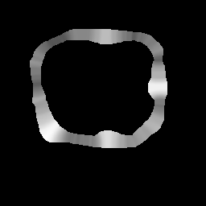 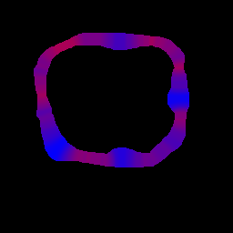 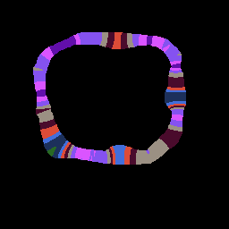

synthetic non uniform ring with a high saliency, colored red-blue
```sh
./thickness2D -n 20 -i 100 -c 2 -s -m --hx 0.5 --hy 0.5 --lw 40 --lc 98 data/domain_anillo_256_2.png output_thickness_2d.png
```
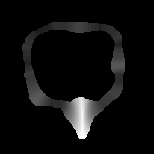 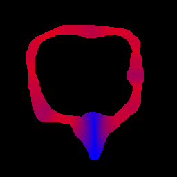 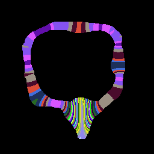

circle inside an ellipse 
```sh
./thickness2D -n 20 -i 100 -c 2 -s -m --hx 0.5 --hy 0.5 --lw 40 --lc 98 data/domain_elipse.png output_thickness_2d_elipse.png
```
 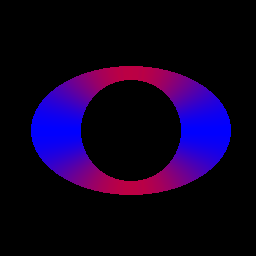 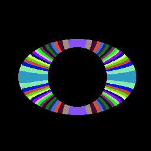

square inside a square
```sh
./thickness2D -n 30 -i 200 -c 2 -s -m --hx 0.5 --hy 0.5 --lw 40 --lc 98 data/domain_cuadrado.png output_thickness_cuadrado.png
```
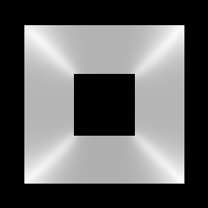 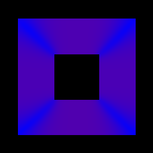 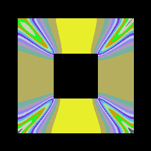

donut: circle inside a circle
```sh
./thickness2D  -n 15 -i 100 -c 2 -s -m --hx 0.5 --hy 0.5 --lw 40 --lc 98 data/domain_donut.png output_thickness_2d_donut.png
```
 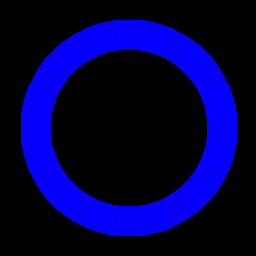 

------------------------------
# thickness2D_knee

Uses the same Laplacian thickness algorithm as `thickness2D`, but for inputs
whose boundaries are already explicitly labeled instead of being derived from a
tissue segmentation. `thickness2D` builds the inner/outer boundaries of the
band itself from the white-matter and cortex labels (via
`compute_boundary_cortex2D`); `thickness2D_knee` skips that step entirely and
runs the Yezzi thickness solver directly on the domain as given, which must
already be in the canonical form `thickness2D` produces internally: outer
boundary = `0`, inner boundary = `1`, band = `--lc` (default `2`). This suits
knee-cartilage data — produced by `compute_boundary2D` — where there is no
white-matter interior from which to infer the boundaries the way there is for
the cortex. It shares the same option-based command line as `thickness2D`, but
`--lw` is accepted only for argument-parsing compatibility and has no effect,
since no boundary derivation happens.

|                        | `thickness2D`                                   | `thickness2D_knee`                          |
|------------------------|--------------------------------------------------|----------------------------------------------|
| Expected input         | Raw tissue segmentation (`--lw`/`--lc` labels)   | Pre-built band domain (0=outer, 1=inner, `--lc`=band) |
| Boundary derivation    | Computed internally (`compute_boundary_cortex2D`) | Skipped — assumed already present in the PNG |
| `--lw`                 | Used to find white-matter/cortex adjacency        | Parsed but unused                             |
| Extra modes            | `-s` (bidirectional sum), `--streamlines`         | None                                          |

## Usage
`thickness2D_knee` now uses the same option-based argument parsing as
`thickness2D` (the old positional `iterations_laplace iterations hx hy reverse
lambda` arguments are gone).
```
thickness2D_knee [options] input2D.png output2D.png
              -d (debug mode)
              -n iterations_thickness (10)
              -i iterations_laplace (100)
              -r (reverse)
              -l lambda (0.5)
              -c color output (0: gray, 1: red-blue, 2: random)
              --hx hy (1)
              --hy hx (1)
              --lc band label (2)
```
Input: 8-bit grayscale PNG; the image dimensions are read from the file (so
       max1/max2 are no longer passed on the command line). The distinct label
       values are printed, and the band label (--lc, default 2) must be present
       in the domain or the program errors out. (--lw is accepted for parsing
       compatibility but not used, since the boundaries are pre-encoded.)
Output: filename ending in ".png" writes a PNG of the thickness map (grayscale,
        or RGB when -c is 1 or 2; background = black); any other extension writes
        a raw float image, as before.

## Examples
```sh
./thickness2D_knee -c 2 -i 200 -n 10 --hx 1 --hy 1 -m data/domain_knee_512.png output_thickness_knee.png
```

------------------------------
# thickness3D 

Volumetric (3D) version of `thickness2D`. Given a segmented volume, it computes
the inner and outer boundaries of the cortex band from the white-matter (`--lw`)
and cortex (`--lc`) labels, solves the 3D Laplace equation between them, and
integrates the normalized gradient to obtain the thickness of the band at every
voxel. Input is either a single `.vols` unsigned-short volume or a numbered
slice series; output is a float volume of per-voxel boundary-to-boundary
distances.

Usage: 
```sh
thickness3D  [options] segmented.vols/segmented_prefix output3D.volf nrows ncols nslices
              -d (debug mode)
              -n iterations_thickness (10)
              -i iterations_laplace (100)
              -w (swapbytes)
              -r (reverse)
              -s (sum)
              -k (knee mode)
              -l lambda (0.5)
              -m compute and show mean thickness
              --lw white matter label
              --lc cortex label
              --hx hy (1)
              --hy hx (1)
              --hz hz (1)
              --DT (compute thickness with Euclidean DT)

Output: volume float file, representing the distances from one boundary to the other according to a metric defined by the laplacian field
Input: unsigned short volume file (with extension vols), or set of files numbered from 001 to nslices 
       segmented data for the cortex white matter and the rest of classes. 
       The input should be labeled as:
          "lc" in the band to compute the thickness (cortex)
          "lw" in the inner (white matter)
           whatever different label, in the outer (outside the brain)

Output: volume float file, representing the distances from one boundary to the other according to a metric defined by the laplacian field
```

## options: 
-d debug option: gives more text information, and saves volumens for gradients 
   (x,y,z), laplacian field, and domain
-w swap bytes after reading input files
-r reverse: compute the thickness from 1 to 0 (without -r thickness is 
   computed from 0 to 1)
-s compute thickness in both directions and sum both results and resting 
   one unit
-k knee mode: computation of boundaries for the knee (experimental)
-n iterations thickness: number of iterations for thickness computation 
   (default 10)
-i number of iterations for laplace computation (default 100) 
-l lamba convergence parameter used in laplace computation (0.5 default 
   value is ok) 
-m compute and show mean and standard deviation of thickness 
--lw label of the interior (white matter, default 3) 
--lc label of the band (cortex, default 2)
--hx --hy --hz voxel size parameters (default: 1,1,1)
--DT compute thickness using Euclidean DT (then laplacian is not used)

## Examples
Caja
```sh
./thickness3D -m -n 20 -i 200 --lw 3 --lc 2 data/input_caja3d.vols Thickness.volf 80 80 80
```
Elipsoid
```sh
./thickness3D -m -n 20 -i 200 --lw 3 --lc 2 data/phantom_elipsoid.vols Thickness.volf 80 80 80
```
Sphere
```sh
./thickness3D -m -n 20 -i 200 --lw 3 --lc 2 data/phantom_sphere.vols Thickness.volf 80 80 80
```
--------------------------------
# thickness3D_knee 

`thickness3D` run in knee mode (`-k`); there is no separate executable. As in
the 2D case, the only difference from the default cortex mode is where the two
boundaries come from: without `-k`, `thickness3D` derives them from the
white-matter/cortex tissue labels (`compute_boundary_cortex3D`); with `-k` it
instead reads a volume in which the cartilage boundaries are already encoded
(interior surface = 1, exterior = 0, cartilage = 128, rest = 255), as produced
by `compute_boundary_knee3D`. The Laplacian thickness computation itself is
identical.

```
Input: volume unsigned char file, where the interior boundary of the knee cartilage is 1, the exterior is 0, and the cartilage has label 128, and the rest has label 255  
Output: volume float file, representing the distances from one boundary to the other according to a metric defined by the laplacian field
```
--------------------------------
# laplace2D 

Solves the 2D Laplace equation over a domain to produce the harmonic scalar
field that underlies the thickness algorithms: 0 on one boundary, 1 on the
other, smoothly interpolated in between. It is useful on its own for inspecting
or visualizing that field. The interior boundary is detected automatically from
the input domain.

## Usage
```
laplace2D [-c color] input.png output.png iterations [lambda]
              -c color output (0: gray, 1: red-blue, 2: random)
```
The domain should be a non-zero region (e.g. label 100) over a zero background,
so the interior boundary can be detected. The image dimensions are read from the
input PNG.

Output: filename ending in ".png" writes a PNG of the field (grayscale linearly
        normalized min..max to 0-255, or RGB when -c is 1 or 2); any other
        extension writes a raw float image, as before.

## Examples 2D:
```sh
./laplace2D data/domain_anillo_poisson.png output_laplace2D.png 100
./laplace2D data/domain_anillo_poisson.png output_laplace2D.flt 100
```
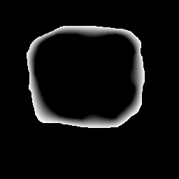

--------------------------------
# laplace3D 

Volumetric (3D) version of `laplace2D`: solves the Laplace equation over a
volume and writes the resulting harmonic scalar field as a float volume.

## Usage: 
```
laplace3D max1 max2 max3 input-prefix output3d-prefix iterations [lambda]
```

## Example 3D
```sh
./laplace3D 80 80 80 data/domain_anillo_3d.vol output_laplace3D.volf 100
```

--------------------------------
# Poisson2D

Solves the 2D Poisson equation over a domain (a variant of the Laplace solver
that includes a source term). This is experimental; the interesting output is
the map of local minima of the resulting field, written as `max_local.png`
(grayscale, 0-255 normalized: background/non-minima pixels are 0/black, and
local-minima values are linearly scaled so the largest maps to 255 — since the
map is sparse, this makes the minima actually visible).

## Usage
```sh
poisson2D input.png output.png|output.flt iterations [lambda]
```
Input: 8-bit grayscale PNG; the image dimensions are read from the file (so
       max1/max2 are no longer passed on the command line).
Output: filename ending in ".png" writes a grayscale PNG of the field (min..max
        normalized to 0-255); any other extension writes a raw float image.
        Also always writes `max_local.png`, the local-minima map.

## Example:
```sh
./poisson2D data/domain_anillo_poisson.png output_poisson.png 200
```
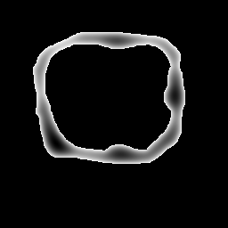
